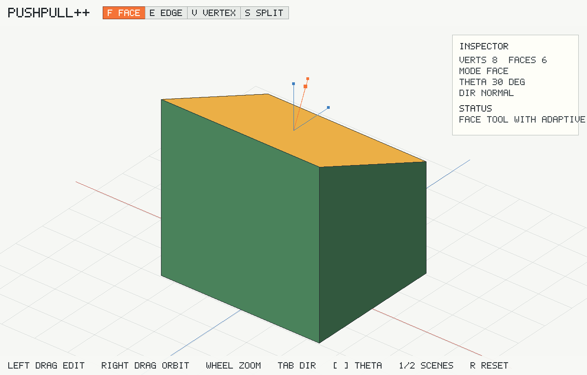
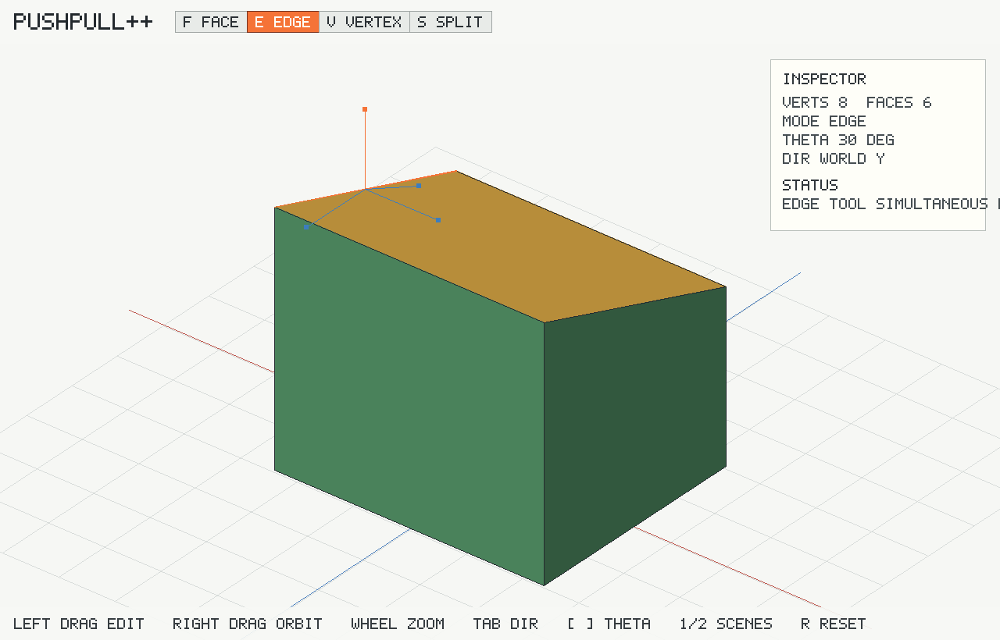
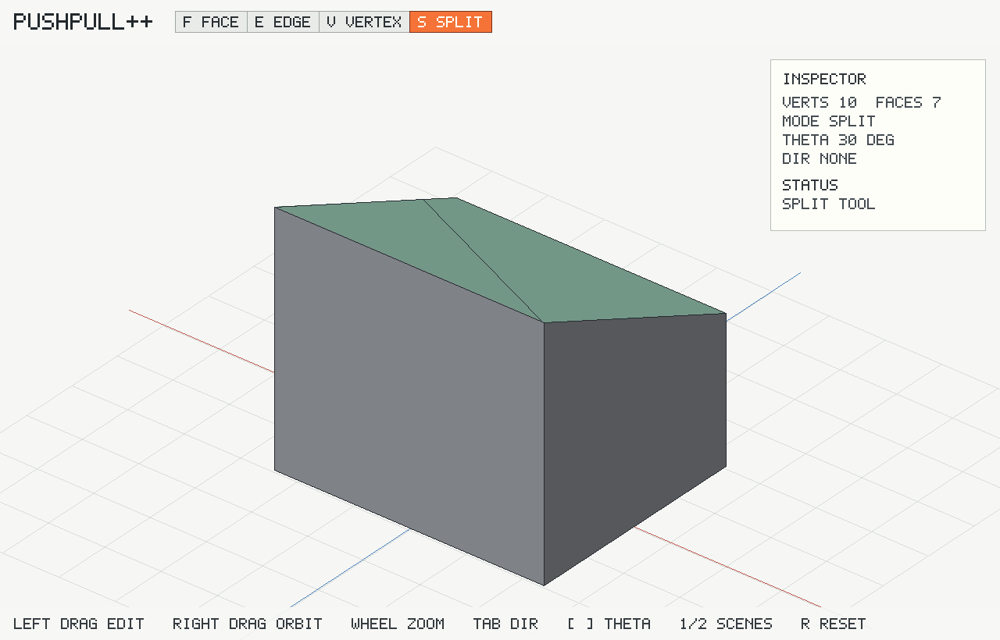

# PushPull++ SDL2 Demo

This is a compact C++17/SDL2 implementation of Lipp, Wonka, and Mueller's **PushPull++** paper.



It implements:

- face-vertex polygon mesh storage
- Hessian plane equations and three-plane intersections
- adaptive face insertion based on the angular threshold from Algorithm 1
- plane-driven local mesh updates for single and simultaneous face modification
- face, edge, and vertex push/pull operations with target-plane construction from the paper
- useful drag direction proposals with Tab cycling
- stepwise/collapse guards that clamp a drag before selected planes cross nearby vertices
- polyline-style face splitting by clicking two points on a face
- local topology cleanup for zero faces, zero edges, unused vertices, and duplicate intersection vertices
- an SDL2 interactive viewer with a toolbar, inspector, status bar, face/edge/vertex picking, orbit, zoom, and push/pull dragging

Texture-coordinate propagation is not included because this SDL2 sample renders untextured debug faces. Global self-intersection detection is also outside the paper's stated scope; the implementation follows the paper's local event handling.

## Screenshots

| Face tool | Edge tool | Split tool |
| --- | --- | --- |
|  |  |  |

## Build

```sh
make
```

or:

```sh
cmake -S . -B build
cmake --build build
```

## Run

```sh
make run
```

## Controls

- `F`: face tool.
- `E`: edge tool.
- `V`: vertex tool.
- `S`: split tool.
- Left click/drag: select and push/pull the active component.
- In split mode, click two points on the same face to split it.
- `Tab`: cycle proposed drag directions.
- Right drag: orbit the camera.
- Mouse wheel: zoom.
- `1`: load a cube.
- `2`: load a slanted block.
- `[` / `]`: lower/raise the adaptive insertion threshold.
- `R`: reset the current model.
- `Esc`: quit.

The window title shows the current threshold and last operation status.

## Test

```sh
./pushpull_pp --self-test
```

The self-test exercises constrained face moves, adaptive insertion, simultaneous edge/vertex modification, and face splitting.
